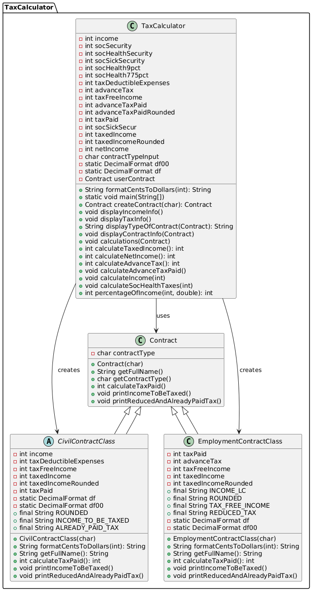

# taxcalculator
TaxCalculator - a kata for a Clean Code exercise

Jean-Marin RIBARIC & Joao DUARTE

We have made the following changes to the code:

- Added string constants for printing text to the user
- Made Adjustments to the variables names to have a consistent naming format
- Seperated the display and calculation part of the program for better readability
- Renamed certain functions for clearer understanding of the code

## UML Diagram

Here is the diagram outlining the new architecture of the code:

  

